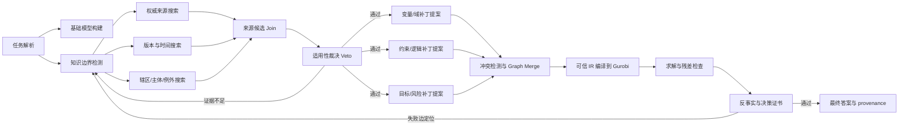

# SearchGraph-OR：面向开放证据建模的 Graph Engineering 框架

## 1. 核心问题

真正需要解决的不是“让 OR Agent 多搜索几次”，而是：

> 给定一个不完整但可执行的基础模型，Agent 如何发现哪些外部事实会改变模型结构，并把来源、适用性、规则主张、模型槽位、方程、代码和求解结果连成一张可验证的证据—模型图？

SearchWorthyOR 当前最有价值的部分是：Gold 规定证据补丁必须改变完整最优行动集合。当前最弱的部分是：
证据候选和补丁模板都过于集中，系统不需要真正构造、扩张和校验这张图。

本项目只聚焦一个问题，可称为 **Search-triggered Model Graph Completion**：

> Agent 能否先发现基础 OR 模型中哪些高影响知识槽必须向开放世界查询，再把检索到的证据补成一条
> 从适用规则到最终决策的闭合模型图？

与它紧密相关的两个现有不足是：

1. 现有搜索 Agent 优化“找到相关文本”，但没有以 OR 决策敏感性决定搜什么、何时回搜；
2. 现有建模 Agent 优化“生成可运行代码”，但没有证明 evidence-to-model-slot 绑定及其决策因果性。

## 2. 为什么采用 Graph Engineering

截至 2026-07-31，2026 年 6 月发布的 Google ADK 2.0 已把 graph-based workflow 作为一等运行时：图中可以同时存在
Agent、确定性函数、路由、并行分支、join、持久状态和 human checkpoint，而不是把所有工作塞进一个
不断膨胀的上下文循环。OpenAI 的 Agent 指南也明确把 manager/tool-call 和 decentralized handoff
视为多 Agent 图，并强调 guardrail、退出条件与人工接管。Anthropic 的 Research 系统使用
orchestrator-worker 和并行研究分支，展示了静态 RAG 与动态多步搜索的区别。

“Graph Engineering”截至目前仍是一个正在形成的工程标签，并不是已有统一定义的学术范式。
更可靠的判断是：近期系统正在同时把三类图变成一等对象——运行时工作图、任务状态/知识图和
跨任务经验图。近期预印本进一步展示了这些不同的“图”：DynaSwarm 按输入动态选择多 Agent 协作图；
Agent-as-a-Graph 把 agent、tool 与归属关系放入知识图做检索；GraphFlow 把原子 workflow
操作组织成共享图，再按任务动态实例化。2026 年的 GraphMind 从生产处置轨迹构造并强化
action-centric workflow graph，EXG 则把跨任务成功与失败组织为可持续演化的 experience
graph。2026 年 5 月的 ExpGraph 进一步使用“有/无所检索经验”的效用差反馈更新图中经验节点；
6 月的 Trellis/Experience Graphs 则把分支、工具输出、奖励、兄弟比较和因果谱系作为可查询、
可回放的数据库状态，而不只是一次性日志。它们支持“图应随任务扩张、图可用于检索、运行时管理、
经验复用与可追溯恢复”这一判断。2026 年 7 月的 AgentFlow 又把 agent、prompt、model、
capability、memory 和 control policy 统一成带 component/control/data-flow 边的 Agent
Dependency Graph，并用它发现 prompt-to-tool 风险；这为工作图的静态能力审计提供了直接依据。
但这些工作都没有
解决 OR 中的核心绑定：
`外部规则主张 → 适用性 → 模型槽位 → 方程 → 求解后的决策变化`。

对 OR 搜索建模而言，图不是通用编排外壳，而是研究对象本身：系统最终需要证明的是
`Source → Claim → Applicability → ModelSlot → Equation → Code → SolverTest → Decision`
这条路径是否闭合。

参考：

- Google ADK 2.0 graph workflow：
  https://developers.googleblog.com/announcing-adk-go-20/
- OpenAI, A practical guide to building agents：
  https://openai.com/business/guides-and-resources/a-practical-guide-to-building-ai-agents/
- Anthropic, How we built our multi-agent research system：
  https://www.anthropic.com/engineering/multi-agent-research-system
- OpenAI BrowseComp：
  https://openai.com/index/browsecomp/
- DynaSwarm（2025 预印本）：
  https://arxiv.org/abs/2507.23261
- Agent-as-a-Graph（2025 预印本）：
  https://arxiv.org/abs/2511.18194
- GraphFlow（2026 预印本）：
  https://arxiv.org/abs/2605.22566
- GraphMind（2026 预印本）：
  https://arxiv.org/abs/2605.17617
- EXG（2026 预印本）：
  https://arxiv.org/abs/2605.17721
- ExpGraph（2026 预印本）：
  https://arxiv.org/abs/2605.30712
- Experience Graphs / Trellis（2026 预印本）：
  https://arxiv.org/abs/2606.29823
- AgentFlow（2026 预印本）：
  https://arxiv.org/abs/2607.01640

## 3. 双层图

### 3.1 工作图 Work Graph

工作图决定“谁在什么时候做什么”。节点既可以是 LLM Agent，也可以是确定性程序。

节点内可以有短局部循环，但全局控制权由图的 typed edge、veto 和 join 决定。不能让一个
“万能反思循环”同时承担搜索、法律适用性、建模和求解。

### 3.2 证据—模型状态图 Evidence-Model State Graph

工作图处理的是执行；状态图保存的是可审计知识。

节点类型：

- `TaskFact`：题面给出的本地事实；
- `OpenSlot`：尚未确定、且可能改变模型的知识槽；
- `Source`：带版本、时间、权威和哈希的来源；
- `Claim`：来源中的可操作规则主张；
- `ApplicabilityPredicate`：时间、辖区、主体、例外；
- `ModelSlot`：变量、索引、域、约束、目标项、作用域、条件逻辑；
- `Equation`：canonical IR 中的数学表达；
- `CodeRegion`：Gurobi 代码区域；
- `SolverTest`：状态、残差、整数性、IIS、最优面；
- `Decision`：行动投影与完整可接受行动集合。

关键边：

- `requires_search(TaskFact, OpenSlot)`
- `retrieved_for(Source, OpenSlot)`
- `supports(Source, Claim)`
- `valid_under(Claim, ApplicabilityPredicate)`
- `binds_to(Claim, ModelSlot)`
- `rewrites(ModelSlot_before, ModelSlot_after)`
- `compiled_to(Equation, CodeRegion)`
- `verified_by(CodeRegion, SolverTest)`
- `changes(SolverTest, Decision)`
- `conflicts_with(Source, Source)`
- `invalidates(Evidence, Edge)`

Agent 不传递完整对话历史，而只沿边传递节点所需的 typed state。这样能防止搜索结果在后续
建模阶段丢失版本和适用范围，也能定位“来源正确但绑定错误”这一 OR 特有失败。

## 4. 动态图扩张规则

### 4.1 只为能改变模型的 OpenSlot 搜索

知识边界检测节点先提出候选槽位，并进行影响测试：

- 若不同可能答案只改变解释文字，不创建搜索节点；
- 若只改变一个已知数值但不触发结构分支，标记为参数更新，不进入主赛道；
- 若可能改变变量族、域、索引、约束、条件逻辑、作用域或目标项，创建 `OpenSlot`；
- 若该变化可能改变可接受行动集合，提高搜索优先级。

### 4.2 基于不确定性和决策影响分配搜索预算

每个 OpenSlot 保存两个量：

- `epistemic_uncertainty`：当前证据不能唯一裁决的程度；
- `decision_sensitivity`：该槽不同取值对可行域或最优行动的影响。

优先级不是纯搜索相似度，而是两者的组合。高相似但低决策影响的文档不应吞掉预算。

### 4.3 Veto 先于 Merge

来源必须先通过权威性、决策时点、辖区、主体和例外五项适用性节点。任一失败，来源不能进入
补丁分支。多个来源冲突时创建显式 conflict edge，而不是让最终 LLM 在长上下文中隐式“综合”。

### 4.4 补丁是 Graph Rewrite

模型更新不允许重写整份模型。每个补丁必须声明：

- 读取了哪些 Claim；
- 命中了哪些 ModelSlot；
- 删除、保留和新增了哪些节点或边；
- 哪些 base 节点受保护；
- rewrite 前后模型哈希；
- 对应 Gurobi 代码 diff。

这使“搜索到正确文档但改错约束”成为可单独评分的错误，而不是被最终 objective mismatch 吞掉。

### 4.5 经验图只吸收经过因果验证的轨迹

执行轨迹可以像 GraphMind、EXG、ExpGraph 和 Trellis 一样沉淀成跨题经验图，但 OR 场景不能
仅按最终 reward 强化整条路径。Experience Graph 必须保存证据快照、模型哈希、求解器输出、
同一父状态下的 sibling patch 和因果负对照，使任一历史时点都能重放“当时已知什么”。只有同时
满足以下条件的局部子图才能提高复用权重：

- 来源与适用性节点通过独立裁决；
- claim-to-model-slot 边通过 binding permutation 负对照；
- Gurobi 代码与 canonical IR 在完整行动投影上等价；
- evidence removal 或错误版本替换会按预期破坏决策证书；
- task-blind 与固定模板攻击不能产生同一条“成功”路径。

失败经验也不保存成自由文本反思，而是保存为带前置状态的错误边，例如
`wrong_version(Source→Applicability)`、`wrong_slot(Claim→ModelSlot)` 或
`incumbent_only(SolverTest→Decision)`。后续任务检索的是相关错误子图和适用前提，而不是整段
历史对话。这样图的演化不会把数据泄漏、偶然最优解或错误但等价的表述当作通用规则。

### 4.6 能力隔离必须由运行时强制

本次 CoE-inspired compatibility 实验给出了一条直接的工程证据：100 题中只有 13 题形成最终
提交，85 题在不同专家节点产生了被审计器拒绝的 `mcp_tool_call`，另有 2 题发生无响应 CLI
进程失败。越权调用分布在 ParameterExtractor、TerminologyInterpreter、ModelingExpert、
ProgrammingExpert 和 CodeReviewer 五类节点，而不是集中在单一坏节点。这说明“在提示词里要求
某专家不要用工具”不是可靠的图边界。

因此每个节点必须获得最小化、运行时强制的 capability set：

- 抽取、术语解释和代码审查节点默认没有搜索或文件工具；
- Source 节点只能访问检索接口，不能直接改模型；
- ModelSlot/Equation 节点只能消费通过适用性 veto 的 typed claim；
- CodeRegion 节点只能调用受控编译、Gurobi 与残差检查；
- 任一越权工具事件在节点边界立刻失败，并沿显式错误边路由，而不是让其输出继续污染下游。

部署前还应从 Agent 源码静态恢复一张 framework-independent capability/dependency graph，
检查 prompt 或上游不可信数据能否沿 control/data-flow 边到达搜索、文件或求解工具；运行时
trace 再与该允许图逐边比对。这个设计吸收了 AgentFlow 的 typed Agent Dependency Graph 思路，
但把 OR 特有的 evidence-to-equation 与 solver certificate 继续保留在 Evidence-Model State
Graph 中，二者不能混成一张没有类型边界的日志图。

另一个必要机制是显式回边。SWOR037 的 CoE 提交在 Gold 证据未进入 top-5 后，所有后续专家都无法
从缺失候选中恢复正确规则。图控制器必须允许
`Claim/ModelSlot validation failure → OpenSlot → Source`，并依据失败边改写查询或扩大来源范围；
固定的单次检索加线性专家链没有这个恢复能力。

搜索预算也必须体现为图上的可行动作集合，而不只是提示词中的数字。当前 OptiMiner
compatibility controller 在最后检查轮仍使用允许 `search` 的同一 schema，因此模型可能在
`4/3` 轮继续请求检索并以“超过最大研究轮数”失败。SearchGraph-OR 到达预算边界时应删除
`Controller → Search` 边，只保留 `final-with-certificate` 或 `abstain/escalate` 两条 typed
edge；停止规则由运行时 action mask 强制。

## 5. 图上的验证和停止条件

### 5.1 结构验证

- 每个新增方程必须至少有一条入边来自已通过适用性检查的 Claim；
- 每个外部 Claim 必须绑定到明确 ModelSlot，不能只出现在解释文字；
- 未命中的 base 目标和约束必须保持；
- action projection 必须在搜索前冻结。

### 5.2 Gurobi 验证

- canonical IR 由可信编译器生成 Gurobi 模型；
- 检查 `OPTIMAL/INFEASIBLE/UNBOUNDED`、残差、边界和整数性；
- 小模型枚举完整最优行动集合；
- 一般模型用最优面与公共行动可行性测试；
- 失败时把错误路由到产生该 Equation/CodeRegion 的节点，不做全局无差别 retry。

### 5.3 搜索因果验证

最终证书不仅比较 base 和 patched，还执行：

- evidence removal；
- distractor-only；
- wrong-version/wrong-jurisdiction swap；
- claim 保留但 model binding 打乱；
- task-blind retrieval。

只有正确证据路径被移除或替换时模型/决策发生预期变化，才能说 Agent 真正依赖了搜索。

### 5.4 停止

只有以下条件全部成立才结束：

- 没有高影响 unresolved OpenSlot；
- 每个外部模型编辑都有闭合 provenance path；
- 来源冲突已解决或显式升级人工；
- Gurobi 与决策证书通过；
- 反事实测试支持搜索因果性。

达到调用预算但仍有高影响 OpenSlot 时，正确输出是 `abstain/escalate`，不是猜一个补丁。

## 6. 错误定位

| 错误边 | 含义 | 可观察失败 |
|---|---|---|
| TaskFact → OpenSlot | 未发现真正缺失的外部知识 | 没搜索，直接解 base |
| OpenSlot → Source | 查询或检索失败 | Hit@k 低 |
| Source → Applicability | 版本、辖区、主体、例外判断错 | 引用相似但不适用文档 |
| Source → Claim | 规则抽取错 | 找对文档、读错条款 |
| Claim → ModelSlot | evidence-to-formulation binding 错 | 文档正确、变量/约束位置错 |
| ModelSlot → Equation | 数学补丁错 | typed patch 错 |
| Equation → CodeRegion | Gurobi 实现错 | 代码失败或模型不等价 |
| CodeRegion → SolverTest | 求解/残差检查不足 | 把非最优或不可行当成功 |
| SolverTest → Decision | 只比较 incumbent 或投影错 | multiple optima 判定错 |

这张表也是 trajectory evaluator 的标签空间，比一个统一的“建模错误”更适合训练 verifier 或
workspace-event PRM。

## 7. 相对现有方法的根本区别

- 相对 OPTIMUS：从按顺序生成参数—目标—约束—代码，变为由 OpenSlot 和 evidence graph
  动态决定哪些分支需要搜索，且每个补丁保留 provenance。
- 相对 Chain-of-Experts：专家不只是传递自由文本；其输出必须成为 typed node/edge，并在 join
  节点做冲突检测。
- 相对 training-free OptiMiner：搜索不只是获得“建模知识”；外部事实可以合法改变模型，但必须
  经过 applicability veto 和 graph rewrite。
- 相对通用 Deep Research：最终产物不是带引用的文本报告，而是可执行、可求解、可反事实验证的
  优化模型和决策证书。

## 8. 对下一版数据集的直接要求

要真正评测 SearchGraph-OR，下一版不能只把 100 题映射到 7 种匿名补丁签名。至少需要：

- 一题含多个相互依赖的 OpenSlot，而不是一份证据对应一个补丁；
- 证据跨多个来源，部分支持、部分冲突、部分仅限定适用范围；
- 正确来源不总是候选文档 medoid，来源版式与 Gold role 独立；
- 同一政策在不同 task facts 下绑定到不同 ModelSlot；
- 包含删除变量、重索引、修改既有约束作用域、跨期/跨实体耦合和目标项重构；
- base 与 patch 的差异不能被四类固定模板覆盖；
- 必须通过 task-blind、source-style、template-classifier 和 GitHub contamination 攻击；
- 对每条失败保存错误边 Gold，支持图级过程评测。

最终研究对象应从“是否搜到正确文档”升级为：

> Agent 是否构造了一条从开放世界证据到 OR 决策的正确、闭合、可反事实验证的图路径。
