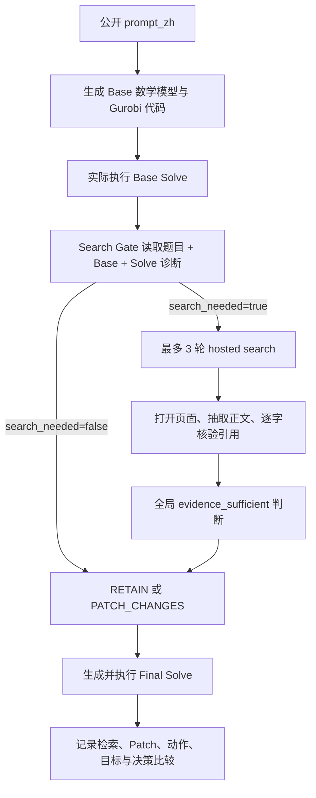

# 02｜Direct / Chain1：Base-Solve Gated Search

## 1. 它想回答什么

Direct 的直觉是：先把题目变成一个可执行的 OR Base Model，并实际求解；只有看到“模型哪里可能依赖题外现实知识”后，才决定是否搜索。检索到的证据只用于修改必要模型部分，之后重新求解并比较决策。

## 2. 当前真实流程



### 阶段 A：Base Model

Base 不是文字摘要。模型调用必须返回：

- 决策变量；
- 目标函数；
- 约束；
- 假设；
- 自包含 `gurobipy` 代码；
- 声明的 action IDs 与目标值。

代码随后真实执行，记录 solver 状态、动作和目标。若 Base 因 provider、解析或执行失败而未完成，会以具体失败类型保留，不能用一段自然语言冒充 Solve。

### 阶段 B：搜索边界

当前 gate 是一个**简单 baseline 判断**：

```text
NeedSearch =
  存在缺失的题外现实知识
  AND
  该知识可能影响 applicability、feasibility、constraint、
  parameter、objective 或 action mapping
```

Gate 输出：

```json
{
  "search_needed": true,
  "trigger_reason": "...",
  "external_unknowns": ["..."],
  "first_query": "..."
}
```

第一轮搜索不是强制的。若 gate 失败，系统保守地记为未触发并继续 Final，而不是让整条链无答案。

这个 gate 的科学局限很清楚：它依靠 LLM 自我判断“可能影响”，没有执行敏感性分析、反事实求解、价值信息估计或决策后悔界。

### 阶段 C：最多三轮检索

触发后使用共享 hosted-search。第一轮查最关键未知量；后续轮次根据页面失败、未核验引用或 `missing_rule_reason` 生成不同的 continuation query。一次查询最多一个 `site:`，不得包含 benchmark ID、Gold、私有路径或输出 schema。

### 阶段 D：证据提取

模型从成功打开的页面中选择一条或多条引用，每条引用必须在正文中通过空白归一化后的逐字匹配。标题和 snippet 只用于发现网页，不算证据。

当前证据闭合最终被压成一个全局 `evidence_sufficient` 布尔值。它的语义是：现有核验证据是否足以判断 applicability，以及所有由外部未知量引起的模型修改。若 Multi 问题有多个待改位置，这个布尔值不能显示“哪个原子已覆盖、哪个仍缺失”。

### 阶段 E：Patch 与 Re-solve

Final 同时看到 prompt、Base、Base Solve、检索诊断和核验证据。即使证据不足，也必须完成“当前最可辩护模型”的建模和求解，并在 reasoning 中暴露限制。

Final 只能声明：

- `RETAIN`：`applicability=false` 且 `patch=[]`；
- `PATCH_CHANGES`：`applicability=true` 且 Patch 非空。

随后再次执行 Gurobi 代码并记录 Final actions/objective。

## 3. 这条链的优势

- 搜索问题有 Base 模型上下文，更容易指向具体参数、约束或动作映射。
- Base 与 Final 都真实求解，可观察搜索/Patch 前后是否改变决策。
- 检索失败不会被伪装成 provider 失败，也不会阻止 Final 尝试。
- 与 Search-First 共用完全相同的搜索实现，便于研究顺序效应。

## 4. 必须正视的局限

1. **搜索边界仍是定性布尔判断。** “可能影响”没有被求解器证实。
2. **Base 锚定。** 错误 Base 可能让 gate 只搜索它已经想到的缺口。
3. **多缺口没有显式账本。** `external_unknowns` 可以有多项，但三次查询是 case 总预算，证据充分性只有一个布尔值。
4. **证据到模型没有 typed binding。** 引用进入 Final prompt，但没有强制声明“此引用支持 Patch 的哪个字段”。
5. **Patch 最小性主要由 prompt 约束。** 尚无确定性检查证明未修改无关槽位。
6. **当前 `decision_comparison` 比较的是 LLM 声明的 Base/Final actions 和 objectives。** 它没有直接以实际捕获的 `base_solve.solver_actions` 与 `final_solve.solver_actions` 作为唯一真值；声明与求解器捕获不一致时可能误判“决策是否改变”。
7. **证据不足仍给出 Final。** 这是 baseline 设计，不代表现实知识已被证明；报告时必须把 retrieval 状态和 answer 状态拆开。

第 6 点是下一版 Agent 很有价值的改进入口：把“Patch 是否改变决策”改为求解器捕获值驱动，并加入声明—执行一致性门禁。

## 5. 对学弟的检查问题

- 能否用 Base 模型的参数区间或约束开关，证明某缺口是否 decision-critical？
- 如果 Base 本身漏建了一个现实约束，negative-space audit 如何发现“模型里不存在的槽位”？
- 多个 Gap 应按什么优先级共享三次查询预算？
- 一条证据如何绑定到 `constraint/parameter/objective/action_mapping` 中的精确位置？
- RETAIN 是否也需要一份“为何不改”的可验证证书？

## 6. 实现入口

- [Direct runner](../../scripts/run_direct.py)
- [共享 gated pipeline](../../scripts/gated_search_pipeline.py)
- [候选模型执行与标准化](../../scripts/candidate_adapter.py)
- [Gurobi 捕获执行器](../../scripts/execute_candidate.py)
