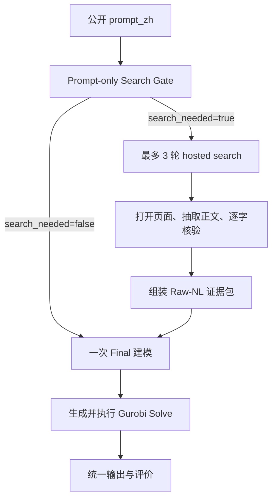

# 03｜Search-First / Chain2：Gated Raw-NL

## 1. 它想回答什么

Search-First 把搜索判断放在建模之前：先只看题目判断是否缺现实知识，若需要则检索并形成自然语言证据包，然后一次性建模求解。它的核心假设是：避免先建一个可能错误的 Base，可以减少错误模型对搜索问题和最终 Patch 的锚定。

## 2. 当前真实流程



### 阶段 A：Prompt-only Gate

Gate 只读公开 `prompt_zh`，prompt 明确禁止它提前建模、总结、假设或求解。它使用与 Direct 相同的简单判断式，并返回 `search_needed`、`trigger_reason`、`external_unknowns` 和 `first_query`。

第一轮搜索也不是强制的。差别在于：这里没有 Base Model 或 Base Solve 帮助判断某个未知量是否会改变最优决策，因此它更依赖自然语言层面的风险识别。

### 阶段 B：与 Direct 完全相同的联网

Search-First 调用同一个 [检索模块](../../scripts/web_retrieval.py)，共享 3 次查询、18 次页面尝试、9 个成功可读页面等预算，也共享 `site:`、相关性、页面抽取和逐字引用核验。不能给 Search-First 换另一个搜索引擎后继续声称它与 Direct 是顺序对照。

### 阶段 C：Raw-NL 证据包

已核验证据以以下自然语言块交给 Final：

```text
RETRIEVAL_STATUS: ...

EVIDENCE_1
SOURCE_URL: https://...
PUBLISHER: ...
VERBATIM_EVIDENCE: 网页正文中的核验原句
```

拼接的是“检索状态 + 来源 URL + 发布主体 + 已核验正文引用”，不是 Gold、预期 Patch 或标准答案。Raw-NL 的优点是简单且接近一般 LLM 使用方式；缺点是没有机器可检查的 `evidence → applicability atom → model slot → patch operation` 映射。

### 阶段 D：一次建模并求解

Final 同时解释证据、判断 RETAIN/PATCH_CHANGES、构造数学模型、生成代码并求解。即使没触发搜索、证据不足或页面全失败，也必须尝试完成 Final，并把检索失败单独保留。

## 3. 与 Direct 的严格对照关系

| 维度 | Direct / Chain1 | Search-First / Chain2 |
|---|---|---|
| Gate 看见什么 | prompt + Base model + Base Solve | prompt only |
| 搜索前建模 | 是 | 否 |
| 搜索前求解 | 是 | 否 |
| Search gate 判断式 | 相同 | 相同 |
| Hosted-search 后端 | 相同 | 相同 |
| 查询/页面预算 | 相同 | 相同 |
| 引用核验 | 相同 | 相同 |
| 证据交付 | 与 Base/诊断一起进入 Final | Raw-NL 进入一次 Final |
| Final 求解 | Re-solve | 首次 Solve |
| 前后决策比较 | 有，但当前基于声明字段 | 无 Base，无法比较 |
| 主要风险 | Base 锚定、错误缺口继承 | 缺少决策敏感性、一次调用负担过重 |

这组对照并非只改变一个 token：Direct 多一次 Base 建模/求解调用，计算成本也更高。因此最终应同时报告质量、搜索触发、调用/token/时间成本，不能把质量差异全部归因于“顺序”而忽略额外推理预算。

## 4. 这条链的优势

- 搜索问题不受一个已生成数学模型的直接锚定。
- 结构简单，是强历史 baseline 和新 Agent 的必要参照。
- 与 Direct 共享同一搜索层，能较干净地观察前置/后置建模差异。
- 即使检索层失败，仍有明确 Final 尝试，便于拆分检索与建模失败。

## 5. 必须正视的局限

1. **Gate 不知道最优解对未知量是否敏感。** 它只能语言化猜测 decision criticality。
2. **一次 Final 调用负担过重。** 证据解释、适用性、Patch、建模、代码和求解被压在同一阶段。
3. **Raw-NL 没有 typed binding。** 模型可能正确引用规则却修改错约束。
4. **没有 Base/Final 对照。** 无法直接归因“证据改变了什么”。
5. **多缺口仍被一个全局 sufficiency 布尔值压缩。**
6. **证据不足仍输出答案。** 不能把 Final 成功误报成证据闭合。

## 6. 应验证的配对假设

- H1：Base-Solve 会提高搜索问题的具体性和证据命中率。
- H2：Base-Solve 也可能增加错误模型锚定，降低漏建现实约束的召回率。
- H3：Search-First 在搜索触发召回上更高，但可能产生更多非决策关键搜索。
- H4：Direct 的额外成本只有在 Final joint accuracy 或检索闭合率显著提升时才值得。

需要用 240 个 paired case 的逐题结果和 exact McNemar，而不是仅比较两个总百分比。

## 7. 实现入口

- [Search-First runner](../../scripts/run_search_first.py)
- [共享 gated pipeline](../../scripts/gated_search_pipeline.py)
- [共享网页检索](../../scripts/web_retrieval.py)
