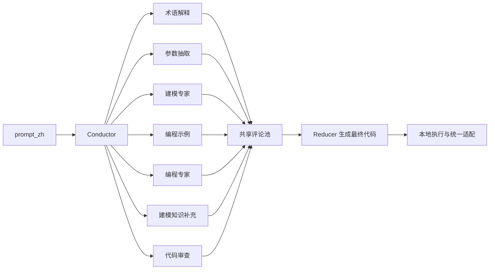
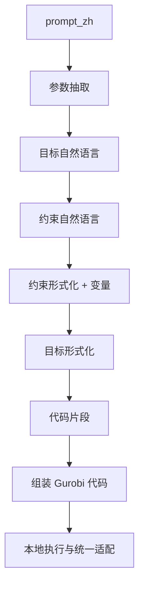
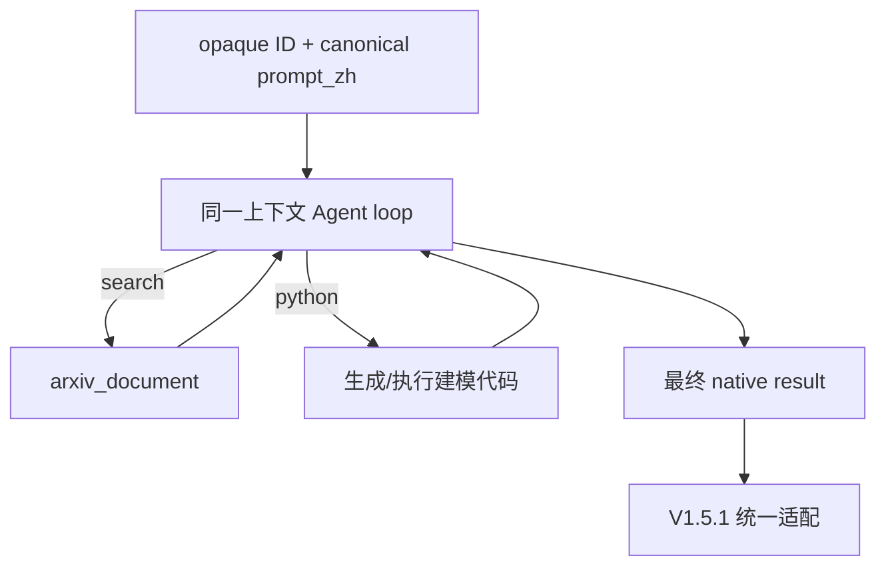

# 04｜三个 Native Baseline：CoE、OptiMUS、optiminer-training-free

本页始终区分“原方法思想”和“本实验实际配置”。评审时只能按后者解释 V1.5.1 结果。

## 1. CoE：多专家 OR 建模

### 原方法思想

Chain-of-Experts（CoE）把复杂 OR 建模交给多个角色协作：Conductor 选择所需专家，专家逐步构造或检查模型，Reducer 汇总成为最终解。原论文还描述 forward construction 与 backward reflection。

### 当前实验实际链路

当前 adapter 保留 7 类专家和 Conductor–Experts–Reducer 结构，但配置为：

- 最多选择 3 个专家；
- `max_trials=1`；
- `enable_reflection=False`；
- 不允许网页搜索；
- 所有 LLM 调用经兼容层固定到 Shubiaobiao；
- 原外部仓库只读，本实验目录只做 V1.5.1 输入、执行和统一输出适配。

因此，本结果检验的是“受限预算的多专家建模与汇总”，不是原论文全部反思能力。Applicability/Patch 若 native 输出没有明确给出，只能记 `NOT_OBSERVED`。

### 它能帮助回答什么

- 多角色分工能否降低纯建模错误？
- 专家选择与 Reducer 汇总是否比单次建模稳定？
- 没有现实网页证据时，多专家是否仍会把题外知识当作事实？

它不能回答“hosted web evidence 是否改善法规适用性”，因为它没有该权限。

## 2. OptiMUS：模块化 OR 建模与代码生成

### 原方法思想

OptiMUS 把自然语言到优化模型拆成参数、目标、约束、形式化和代码等模块；OptiMUS-0.3 进一步讨论错误修正与 RAG 等能力。

### 当前实验实际链路

当前依赖仓库的实际配置是：

- `ERROR_CORRECTION=False`；
- `RAG_MODE=None`；
- 无网页搜索；
- Shubiaobiao 兼容层替换其 LLM 请求接口；
- 外部仓库保持只读。

所以本 baseline 检验“模块化 formulation decomposition”，不能把论文中的 RAG/错误修正能力算进本实验。Applicability/Patch 未显式输出时同样记 `NOT_OBSERVED`。

### 它能帮助回答什么

- 把参数、目标、约束分别生成，是否比单次自然语言到代码更稳？
- 失败主要发生在语义建模、代码拼接还是统一输出契约？
- 专用 OR pipeline 在无外部现实证据时能达到什么上限？

## 3. optiminer-training-free：arXiv 建模知识检索

### 名称边界

这是本地 **training-free agent loop**，不是官方训练版 Opt-Miner。官方 Opt-Miner 的核心贡献包括面向 optimization modeling 的 information-seeking agent 与 tree-guided data synthesis；不能把本地 runner 的结果称为官方模型复现结果。

### 当前实验实际链路

关键配置：

- 公开 case 映射为 `OMB001...OMB240`，不暴露 C1/C2 语义标签；
- benchmark packet 中 `answer` 是字面占位符 `PRIVATE_GOLD_NOT_AVAILABLE_TO_RUNNER`；
- 每一步只能输出一个 `<search>` 或 `<python>` 动作；
- 最多 3 个 research turns、最多 12 个 agent steps；
- 搜索后端固定为 `arxiv_document`；
- query 必须围绕优化问题、模型家族或 formulation technique；
- 不允许把 hosted web 或本地法规数据偷偷替换进来；
- parse repair、debug retries、search retries 均为 0；
- 子进程通过本地 capability proxy 调 Shubiaobiao，不拿到真实 API key。

### 它能帮助回答什么

- Agent 主动查找“如何建这种优化模型”的论文知识是否有用？
- 搜索与 Python 交替是否比固定模块 pipeline 更灵活？
- training-free loop 在无调试重试时的鲁棒性如何？

它不能提供针对具体辖区、日期、主体、阈值或行为后果的开放网页证据。arXiv 建模知识与现实法规知识是两种不同信息需求。

## 4. 三者与 Direct/Search-First 的关系

| 方法 | 主要知识来源 | 分解机制 | 现实证据准入 | 可直接做搜索顺序对照 |
|---|---|---|---|---:|
| CoE | 模型参数知识 | 多专家角色 | 无 | 否 |
| OptiMUS | 模型参数知识 | 固定模块流水线 | 无 | 否 |
| optiminer-training-free | 模型 + arXiv 文档 | 搜索/编程 Agent loop | 无开放网页适用性证据 | 否 |
| Direct | 模型 + 条件开放网页 | Base/Patch 双求解 | 弱全局核验 | 是 |
| Search-First | 模型 + 条件开放网页 | Raw-NL 后一次建模 | 弱全局核验 | 是 |

这三种 native baseline 的价值，是帮助定位新 Agent 的改进来自多专家、模块化建模、建模知识检索，还是来自真正的现实知识触发与证据绑定。

## 5. 实现入口

- [CoE/OptiMUS 统一 native adapter](../../scripts/run_local.py)
- [optiminer adapter](../../scripts/run_optiminer.py)
- [opaque harness 构造与检查](../../scripts/prepare_harness.py)
