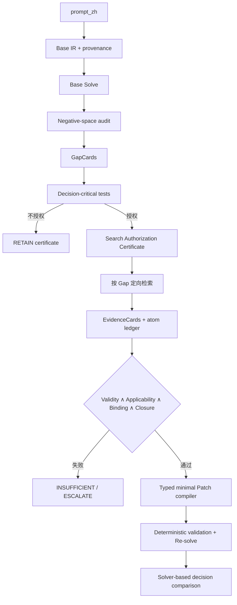

# 06｜下一版 Agent 的科学问题与 Idea Brief

## 1. 研究主线

下一版 Agent 不应只变成“更长的 Direct”。最有区分度的主线是两个可证伪的 OR-specific control：

1. **触发搜索的边界**：什么缺口值得搜索，什么缺口即使未知也不会改变当前最优决策？
2. **信息融合校验**：什么证据可以进入数学模型，支持哪个 Patch，为什么该 Patch 足够且最小？

可再加两个闭环问题：

3. **多缺口预算分配**：有限查询下先解决哪个 Gap？
4. **停止边界**：什么时候证据和决策已稳定，继续搜索不再值得？

## 2. 建议的最小 Agent 骨架



Base IR 至少要记录每个参数、约束和动作映射来自题内文字、默认假设还是外部待证知识。没有 provenance，就无法判断“模型缺什么”。

## 3. 科学问题一：如何量化搜索边界

对每个候选缺口 `g`，至少判断三个条件：

```text
AuthorizeSearch(g) =
    Unresolved(g)
    AND ExternalResolvable(g)
    AND DecisionCritical(g)
```

- `Unresolved`：题内信息和已知模型不能确定它。
- `ExternalResolvable`：公开外部来源原则上能回答它，而不是缺少题内数值或用户偏好。
- `DecisionCritical`：在合理候选值/规则状态下，最优动作、可行域或目标排序可能改变。

### 一个可执行的 decision-critical test

把 Gap 映射到模型槽位，例如参数 `p`、约束开关 `z` 或 action mapping `m`。构造合理的候选状态集 `Ω_g`，分别重求解：

- 若所有状态下最优动作集合相同，且目标差在容忍区间内，暂不授权搜索；
- 若任一状态改变可行性、最优动作或关键目标排序，授权搜索；
- 若无法构造状态集，标为 `UNCERTAIN`，进入受限探索或升级。

这比“LLM 觉得可能有影响”更可证伪。评价指标应包括 trigger precision/recall、少搜次数、漏搜造成的 regret，而不只是最终 accuracy。

## 4. 科学问题二：如何让证据进入模型

不建议只给网页打一个 0–100 总分，因为高总分会掩盖一个致命缺项。更合适的是门控 lattice：

```text
ADMIT(e, g, slot) =
    VALID(e)
    AND APPLIES(e, case)
    AND BINDS(e, slot)
    AND CLOSED(evidence_set, g)
```

- **VALID**：URL 可追踪、正文可读、引用逐字存在、来源身份明确。
- **APPLIES**：日期、辖区、主体、条件和例外与当前 case 匹配。
- **BINDS**：证据明确支持某个 `parameter/constraint/objective/action_mapping` 槽位。
- **CLOSED**：该 Gap 所需的所有事实原子都已支持，且无未处理矛盾。

每个 EvidenceCard 建议包含：

```yaml
gap_id: G2
source_url: ...
publisher: ...
verbatim_quote: ...
validity: SUPPORTED
applicability_atoms:
  jurisdiction: SUPPORTED
  effective_date: SUPPORTED
  covered_entity: SUPPORTED
  threshold: UNRESOLVED
binds_to:
  slot_type: constraint
  slot_id: capacity_limit_3
claim: ...
status: INCOMPLETE
```

只有门控通过的 Card 才能交给白名单 Patch compiler。Compiler 只允许类型化操作，例如 `ADD_CONSTRAINT`、`UPDATE_PARAMETER`、`REMOVE_ACTION`、`CHANGE_OBJECTIVE_TERM`；随后做 schema、维度、单位、可执行性和未授权差异检查。

## 5. 四个可继续深化的 Idea Seed

### 高上限 Idea A：Decision-Regret Search Boundary

**一句话**：用求解器反事实得到“未知现实规则可能造成的最大决策后悔”，只搜索 regret 上界超过阈值的 Gap。

- **新意潜力**：把 adaptive retrieval 从语言复杂度分类变成 OR 决策敏感性控制。
- **最难点**：未知规则的候选状态如何不借用 Gold 构造；多最优解和尺度不同的目标如何归一化。
- **关键消融**：LLM boolean gate vs sensitivity-only vs regret-bound gate。

**击杀条件**：若候选状态构造经常依赖 oracle，或 trigger 指标不优于简单 gate，这个 idea 不成立。

### 高上限 Idea B：Proof-Carrying Model Patch

**一句话**：每个 Patch 必须携带从逐字证据、适用性原子、模型槽位到 solver 变化的可验证证明链。

- **新意潜力**：评价对象不再是“回答引用了网页”，而是“现实证据是否被合法编译进可执行 OR 模型”。
- **最难点**：自然语言规则到 typed slot 的绑定，以及等价模型变换下的 Patch 最小性。
- **关键消融**：Raw-NL vs EvidenceCard vs EvidenceCard + compiler + deterministic validator。

**击杀条件**：若 proof pass 与语义正确性无相关性，或只增加拒答而不改善 full-agent joint，需要重构门控。

### 实用 Idea C：GapCard + Multi-Atom Coverage Ledger

**一句话**：把 `external_unknowns[]` 升级成结构化 GapCard，并用覆盖矩阵管理三次 query。

每张 GapCard 包含来源类型、影响槽位、决策临界性、待证原子、优先级和停止条件。每轮 query 选择“单位搜索成本预计减少最多关键未覆盖原子”的 Gap。

**优点**：实现成本小，直接修复 Multi 问题和全局 bool。

**风险**：如果只变成复杂 prompt 而没有确定性 validator，论文贡献偏弱。

### 实用 Idea D：Solver-Verified Patch Stability

**一句话**：以真实 solver capture 比较 Base/Final，并做局部证据移除或参数扰动；只有决策变化能被授权 Patch 解释时才接受。

检查：

1. LLM 声明动作是否等于 solver 捕获动作；
2. 未授权槽位是否保持不变；
3. 移除某证据后，对应 Patch 是否失去支持；
4. 在证据允许的误差范围内，Final 决策是否稳定。

**优点**：可先作为 validator 插入现有 Direct，改动小且可单独消融。

**风险**：稳定不等于语义正确，仍需 Applicability/Binding 门。

## 6. 最小可发表实验矩阵

先固定同一模型、provider 和查询预算，只替换两个核心机制：

| 组别 | 搜索边界 | 证据准入 |
|---|---|---|
| B0 | 当前 LLM boolean | 当前 Raw-NL/global bool |
| B1 | Decision-critical gate | 当前准入 |
| B2 | 当前 gate | EvidenceCard + typed binding |
| Full | Decision-critical gate | EvidenceCard + typed binding |

主指标：

- Final action/objective joint；
- full-agent joint；
- trigger precision/recall/F1；
- evidence atom coverage 与 false admission；
- Patch semantic correctness/minimality；
- solver-declared consistency；
- queries/pages/tokens/time；
- 因错误“不搜”造成的 decision regret。

只有 `Full > B1/B2 > B0` 的结构性趋势，才支持两个机制互补。若只 Full 好，可能是额外 token/调用带来的混杂。

## 7. V1.5.1 的评价盲点

V1.5.1 适合检验如何找到现实规则并修补模型，但如果绝大多数任务都确实需要官方规则，它无法充分评价“什么时候不应搜索”。建议另建一个小型 **Trigger-36** 先导集：

- 明确需要外部现实知识；
- 题内已经给全、无需搜索；
- 存在未知，但对最优决策不敏感；
- 缺的是题内数据/偏好，公开网页无法解决。

该集合用于 trigger calibration，不替代 V1.5.1 的端到端评价。

## 8. Killer Tests

新 Agent 至少应通过：

1. **No-search test**：题内已给完整规则，不能因关键词就搜索。
2. **Irrelevant-unknown test**：确有未知量，但扰动不改变决策，应停止。
3. **Missing-slot test**：Base 完全漏掉一个现实约束，negative-space audit 能发现。
4. **Multi-gap test**：一个 case 有 3 个独立规则原子，不能一个引用就宣布闭合。
5. **Wrong-jurisdiction test**：来源权威但辖区不适用，必须拒绝。
6. **Expired-rule test**：规则真实但日期失效，必须拒绝。
7. **Quote-true/patch-wrong test**：引用真实但绑定错模型槽位，必须拒绝。
8. **Contradiction test**：两个官方来源冲突，不能静默择一。
9. **Minimality test**：证据只支持改一个参数，不能顺带改目标或动作。
10. **Declared-vs-solver test**：LLM 声明动作与 solver capture 不同，必须失败。

## 9. 哪些方向单独拿出来不够新

已有工作已经覆盖按需/主动检索、检索反思和多专家/模块化建模。所以下列单点通常不足以形成清晰贡献：

- 仅让 LLM 先判断“要不要搜”；
- 仅增加搜索轮数；
- 仅让另一个 Agent 审核网页；
- 仅把证据打一个加权总分；
- 仅组合 CoE + RAG + Solver；
- 仅把 Direct 的 prompt 写得更长。

差异化应落在**决策敏感性决定搜索授权**以及**证据到可执行模型 Patch 的证明链**。

## 10. 给学弟的 Idea 提交模板

请每个 idea 控制在 1–2 页，并逐项填写：

```markdown
# Idea 名称

## 一句话贡献
解决什么可证伪的科学问题？

## 现有 baseline 的具体失败
对应哪个阶段、哪个字段、哪类 case？

## 新机制
输入、输出、状态、公式/算法和停止条件是什么？

## 为什么不是 generic RAG / 多 Agent
OR-specific 的决策、可行域、目标或 Patch 结构在哪里？

## 最小实现
只需改哪些阶段？哪些部分保持冻结？

## 对照与消融
怎样证明增益来自该机制，而非更多调用/token/搜索？

## 指标
除 final accuracy 外，哪个中间指标直接验证科学假设？

## Killer test 与失败判据
什么结果出现时应主动放弃这个 idea？

## 预期成本
新增模型调用、solver 调用、查询、页面和工程时间。
```
